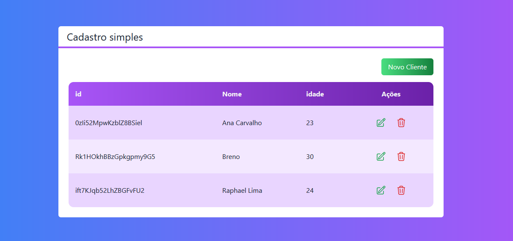
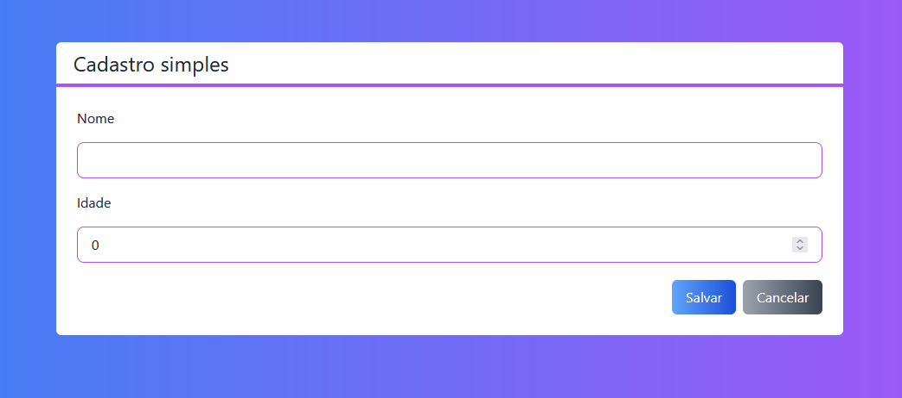
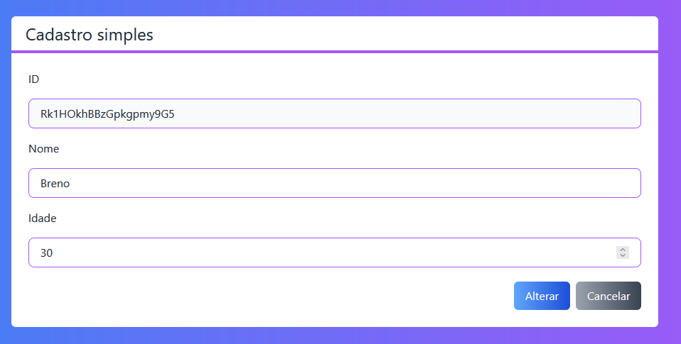

# CRUD NEXTJS 

Projeto de um software para um CRUD de clientes com NEXTJS. 

  

## Minha aplicação: 

  

## Tecnologias utilizadas: 

  

<ul> 

  <li>NEXTJS</li> 

  <li>ReactJS</li> 

  <li>JavaScript</li> 

  <li>TypeScript</li> 

  <li>Firebase</li> 

</ul> 

  
## Sobre a aplicação: 

  
Esse sitema é uma aplicação que consiste nas funcionalidades de criar, alterar, deleter e selecionar um determinado cliente, utilizando todas essas tecnologias para sua construção. 

  
## Ficaria feliz com Feedbacks: 

  

Email: raphaeldesousalm@gmail.com   

Linkdin: https://www.linkedin.com/in/raphaellima98/ 
